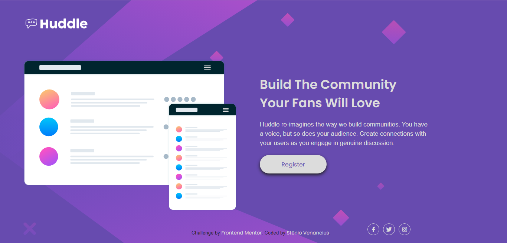

## Pt-Br
------------------------------------------------------------------------------------------------------------------------------------------------ 
# Frontend Mentor - Página de destino do Huddle com uma única seção introdutória
Olá! <br>
Seja muito bem-vindo(a) a minha solução para o desafio do Página de destino do Huddle com uma única seção introdutória no Frontend Mentor (https://www.frontendmentor.io/challenges/huddle-landing-page-with-a-single-introductory-section-B_2Wvxgi0/hub). Este Readme servirá como seu guia para o entendimento deste projeto; ele terá como base o template disponiblizado pela própria plataforma do Frontend Mentor.
<br>
<br>
Sem mais delongas, quero agradeço por disponibiliziar um pouco do seu tempo visitando o meu projeto!

------------------------------------------------------------------------------------------------------------------------------------------------

## Índice

- [Visão Geral](#visão-geral)
    -[Captura de Tela](#captura-de-tela)
- [Meu processo](#meu-processo)
    -[Construído com](#construído-com)
    -[O que aprendi](#o-que-aprendi)
    -[Desenvolvimento Contínuo](#desenvolvimento-contínuo)
- [Autor](#autor)
- [Agradecimentos](#agradecimentos)

------------------------------------------------------------------------------------------------------------------------------------------------

## Visão Geral
### Captura de tela


------------------------------------------------------------------------------------------------------------------------------------------------

## Meu Processo 
### Construído com 
- HTML 
- CSS

### O que aprendi 
Nesse desafio optei por utilizar mais uma vez a pseudo-class root para estilizar as cores dos botões e do icones das redes sociais. Além disso, pude utilizar o Font Awesome para criar os icones que seriam utilizados na landing page. Aprendi que a importação dos icones do Font Awesome se dá através de um link no html e a utilização da tag <i> seguido da classe com o nome do elemento.

``` Pseudo-classe :root
:root {
    /* Colors */
    --Violet: hsl(257, 40%, 49%);
    --Soft-Magenta: hsl(300, 69%, 71%);
}
``` 

``` importação do Font Awesome
<link rel="stylesheet" href="./fontawesome/css/all.min.css">
```

``` Utilização da tag <i> para criar icones
<i class="fa-brands fa-xs fa-facebook-f"></i>
```

### Desenvolvimento Contínuo
Gostei bastante de utilizar o Font Awesome nesse projeto e pretendo utiliza-lo novamente em outros projetos por conta da sua simplicidade e praticidade de inseri-los no código. 

------------------------------------------------------------------------------------------------------------------------------------------------

## Autor 
- Frontend Mentor [@StenioVenancius](frontendmentor.io/profile/StenioVenancius)
- Twitter [@veennix](https://twitter.com/veennix)

------------------------------------------------------------------------------------------------------------------------------------------------

## Agradecimentos 
Muito Obrigado por ter lido até aqui ❣️
Sinta-se avontade para enviar seu feedback!

------------------------------------------------------------------------------------------------------------------------------------------------
------------------------------------------------------------------------------------------------------------------------------------------------
## EN
------------------------------------------------------------------------------------------------------------------------------------------------

# Frontend Mentor - Huddle landing page with a single introductory section

Hello! <br>
Welcome to my solution to the Huddle Landing Page challenge with a single introductory section on Frontend Mentor (https://www.frontendmentor.io/challenges/huddle-landing-page-with-a -single-introductory-section-B_2Wvxgi0/hub). This Readme will serve as your guide to understanding this project; it will be based on the template provided by the Frontend Mentor platform itself.
    <br>
    <br>
    Without further ado, I want to thank you for taking the time to visit my project!
------------------------------------------------------------------------------------------------------------------------------------------------

## Table of contents
- [Overview](#Overview)
    -[Screenshot](#screenshot)
- [My process](#my-process)
    -[Built with](#built-with)
    -[What I Learned](#What-I-Learned)
    -[Continuous-Development](#Continuous-Development)
- [Author](#author)
- [Acknowledgments](#acknowledgments)

------------------------------------------------------------------------------------------------------------------------------------------------

## Overview
### Print Screen


------------------------------------------------------------------------------------------------------------------------------------------------

## My Process
### Built with
- HTML
- CSS

### What I learned
In this challenge, I chose to use the root pseudo-class once again to style the cores of the buttons and icons of the social networks. Also, I was able to use Font Awesome to create the icons that would be used on the landing page. I learned that importing Font Awesome icons is done through a link in the html and using the <i> tag followed by the class with the name of the element.

``` Pseudo-classe :root
:root {
    /* Colors */
    --Violet: hsl(257, 40%, 49%);
    --Soft-Magenta: hsl(300, 69%, 71%);
}
```

``` Font Awesome import
<link rel="stylesheet" href="./fontawesome/css/all.min.css">
```

``` Using the <i> tag to create icons
<i class="fa-brands fa-xs fa-facebook-f"></i>
```

### Continuous Development
I really enjoyed using Font Awesome in this project and I intend to use it again in other projects because of its simplicity and practicality of inserting them in the code.

------------------------------------------------------------------------------------------------------------------------------------------------

## Author
- Frontend Mentor [@StenioVenancius](frontendmentor.io/profile/StenioVenancius)
- Twitter [@veennix](https://twitter.com/veennix)

------------------------------------------------------------------------------------------------------------------------------------------------

## Acknowledgments
Thank you so much for reading this far ❣️
Feel free to submit your feedback!

------------------------------------------------------------------------------------------------------------------------------------------------
